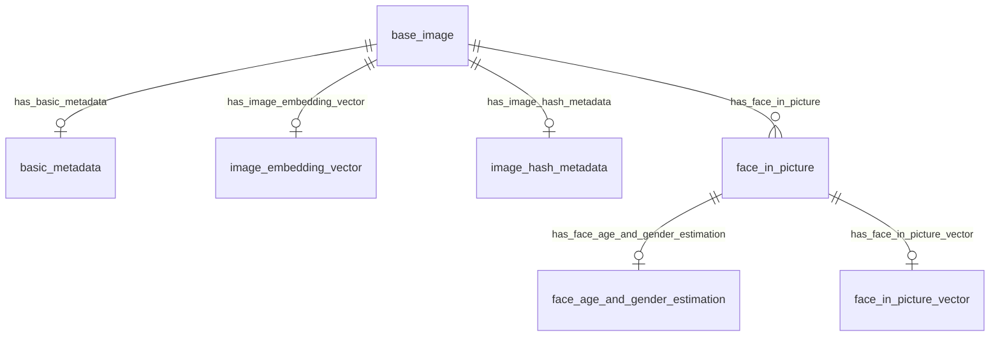

All data is stored in a Surrealdb.
The database can be in memory `mem://`, on disk `rocksdb://my_database` or a remote surrealdb 3.0.0+ instance `ws://surrealdb_server:8000`.

The database schema is as follows:
