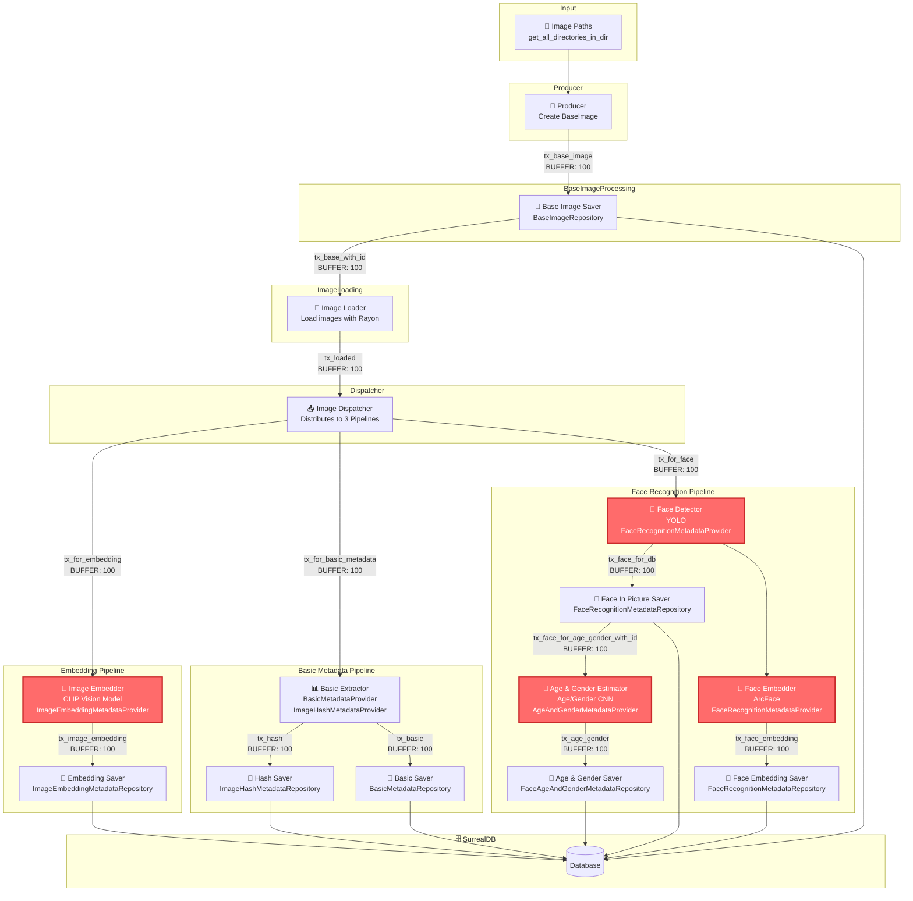
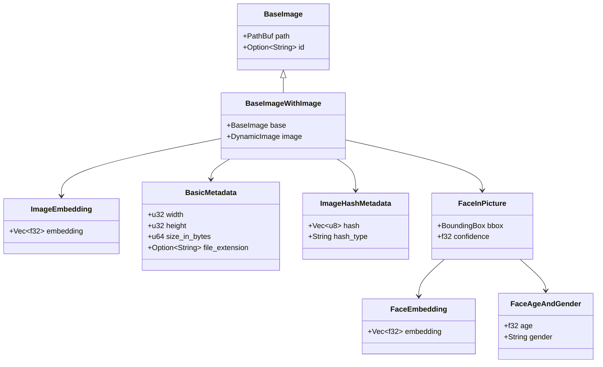

# Metadata Indexer - Data Flow Overview

This documentation describes the data flow of the Metadata Indexer, which processes images and extracts various metadata.

## Architecture

The Metadata Indexer uses a pipeline architecture with multiple parallel components communicating via channels (`crossbeam_channel`).

## Legend

| Symbol | Meaning |
|--------|---------|
| 🤖 | **AI Model** - Neural network inference node |
| 💾 | Database operation (save/load) |
| 📁 | File system operation |
| 📤 | Data distribution/routing |

## Data Flow Diagram

## Component Description

### 1. Producer
- **Task**: Creates `BaseImage` objects from file paths
- **Input**: All image paths from directory
- **Output**: `BaseImage` objects

### 2. Base Image Saver
- **Task**: Persists base image information to database
- **Repository**: `BaseImageRepository`
- **Output**: `BaseImage` with database ID

### 3. Image Loader
- **Task**: Loads images in parallel using Rayon (CPU-bound)
- **Input**: `BaseImage`
- **Output**: `BaseImageWithImage` (contains loaded image data)

### 4. Image Dispatcher
- **Task**: Distributes loaded images to three parallel pipelines
- **Output Channels**:
  - `tx_for_embedding` → Embedding Pipeline
  - `tx_for_basic_metadata` → Basic Metadata Pipeline
  - `tx_for_face` → Face Recognition Pipeline

### 5. Embedding Pipeline
| Component | Description | AI Model |
|-----------|-------------|----------|
| 🤖 Image Embedder | Creates 768-dimensional image embeddings | **CLIP Vision Model** |
| Embedding Saver | Persists embeddings to database | - |

### 6. Basic Metadata Pipeline
| Component | Description | AI Model |
|-----------|-------------|----------|
| Basic Extractor | Extracts hash (SHA256) and basic metadata (size, dimensions, extension) | - |
| Hash Saver | Persists image hashes | - |
| Basic Saver | Persists basic metadata | - |

### 7. Face Recognition Pipeline
| Component | Description | AI Model |
|-----------|-------------|----------|
| 🤖 Face Detector | Detects faces in images | **YOLO** |
| 🤖 Face Embedder | Creates face embeddings from detected faces | **ArcFace** |
| Face In Picture Saver | Persists detected faces | - |
| Face Embedding Saver | Persists face embeddings | - |
| 🤖 Age & Gender Estimator | Estimates age and gender for each face | **Age/Gender CNN** |
| Age & Gender Saver | Persists age/gender estimates | - |

## Configuration

| Parameter | Value | Description |
|-----------|-------|-------------|
| `BUFFER` | 100 | Channel buffer size |
| `BATCH` | 25 | Batch size for processing |

## AI Models Used

| Model | File | Purpose | Architecture |
|-------|------|---------|--------------|
| 🤖 YOLO | `yolo.bpk` | Face Detection | YOLOv8 |
| 🤖 ArcFace | `arcface_model.bpk` | Face Embedding (512-dim) | ResNet-based |
| 🤖 CLIP Vision | `vision_model.bpk` | Image Embedding (768-dim) | Vision Transformer |
| 🤖 Age/Gender | `age_gender.bpk` | Age & Gender Estimation | CNN |

## Data Types

## Parallelization

- **Tokio Tasks**: Asynchronous task processing for I/O-bound operations
- **Rayon**: Parallel processing for CPU-bound operations (Image Loading)
- **Crossbeam Channels**: Thread-safe communication between tasks

## Error Handling

- On full channel: Retry with 1ms sleep
- Logging of stall times for performance monitoring
- Graceful shutdown through channel drop propagation

